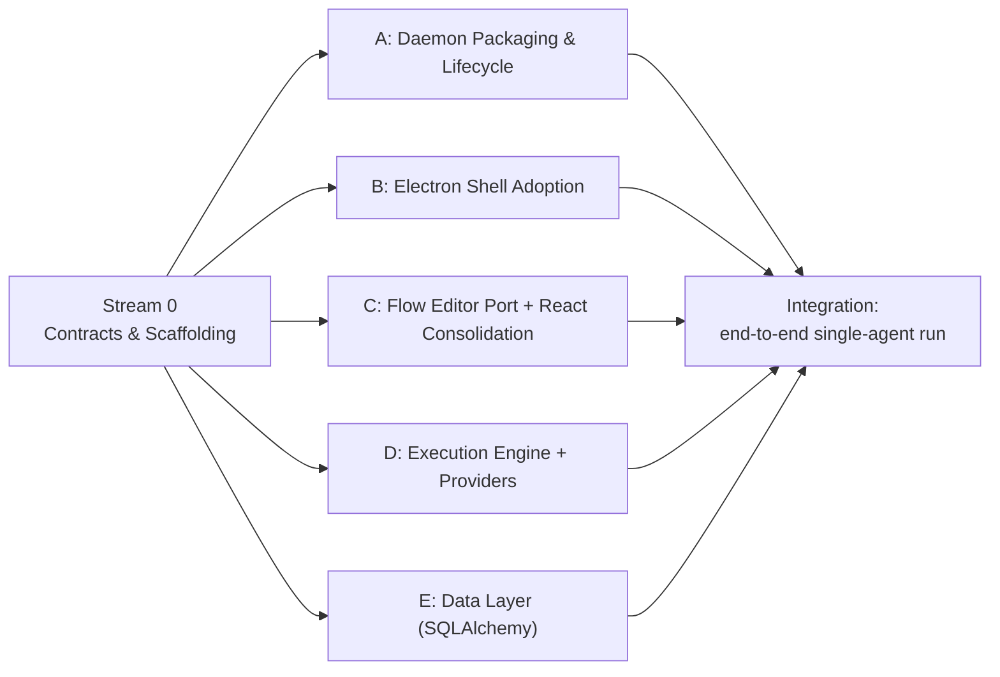

# Taproot Studio — Phase 1 Plan (Foundation)

**Goal of Phase 1:** stand up the skeleton that makes everything else parallelizable —
the monorepo, the Electron shell hosting the existing IDE, an auto-spawned Python daemon
with a stable client contract, and the *thinnest possible* end-to-end path: open the app,
flip to the Agent Manager, run a one-node "agent" flow through the daemon against a provider,
and see streamed output.

Phase 1 is **not** about feature completeness. It is about de-risking the two scariest items
(Python-in-Electron packaging, React/React-Flow consolidation) and locking the contracts
(daemon API, data schema) that let the work split cleanly afterward.

---

## Definition of Done (Phase 1)
- `pnpm`/workspace monorepo builds; `apps/desktop` (Electron) and `apps/daemon` (Python) both run.
- Electron launches → auto-spawns the daemon → health-check passes → graceful shutdown.
- Reaction Studio IDE renders inside the new shell (open project, file tree, Monaco, preview).
- Geminode flow editor renders inside a **flip** surface (Agent Manager), on the **consolidated**
  React + React Flow versions.
- Daemon exposes a versioned HTTP/WS API; a single-agent flow executes end-to-end against the
  **Gemini-first** provider layer and **streams** step output back to the UI.
- SQLAlchemy data layer with initial schema + migrations; flows persist in the daemon and are
  **linked** to a project (no file copy).
- CI runs lint + type-check + unit tests for both apps.

---

## Independent Work Streams

Streams are designed to **not collide** (separate directories / ownership). The only hard
ordering is the **Stream 0 contracts**, which must land first; after that, A–E proceed in parallel.

### Stream 0 — Contracts & Scaffolding *(must land first; small, blocking)*
Owner: lead. Everything else forks from here.
- [ ] Establish monorepo layout: `apps/desktop` (from `reaction-studio`), `apps/daemon` (Python),
      `packages/flow-editor` (from `geminode-studio` editor), `packages/ui` (shared neumorphic),
      `packages/shared-types`.
- [ ] Choose + configure JS workspace manager (pnpm recommended) and Python project (`uv`/Poetry).
- [ ] **Define the daemon API contract** (OpenAPI + WS event schema) and shared TS/Python types —
      run lifecycle, streaming step events (mirror Geminode `ChatMessage`/`onStep`), flow CRUD,
      provider config. This is the seam every other stream codes against.
- [ ] **Define the initial DB schema** (Section 5 of the vision) as the SQLAlchemy source of truth.
- [ ] CI pipeline skeleton (lint, type-check, tests for both apps).

> Deliverable: merged contracts. After this, A–E are independent.

### Stream A — Python Daemon Packaging & Lifecycle *(highest risk — start immediately)*
Files: `apps/daemon/**`, Electron main spawn logic.
- [ ] FastAPI + WebSocket server skeleton implementing the Stream 0 contract (stub responses).
- [ ] Cross-platform interpreter strategy (embeddable Python / PyInstaller / `uv`) + bundling.
- [ ] Electron main: spawn daemon on launch, health-check, restart-on-crash, clean shutdown.
- [ ] Local-only binding + handshake/auth token between Electron and daemon.
- *Touches:* daemon dir + a narrow slice of Electron main. No overlap with renderer streams.

### Stream B — Electron Shell Adoption *(IDE backbone)*
Files: `apps/desktop/**` (renderer shell, excluding flow editor).
- [ ] Bring Reaction Studio in as `apps/desktop`; verify Electron build, `project-manager`,
      FileTree, Monaco, LiveCanvas preview (`component-server` plugin), Inspector all work.
- [ ] Carve out the **Agent Manager** region + the **flip** interaction shell (empty container
      that Stream C fills).
- [ ] Promote the neumorphic design system into `packages/ui` for reuse.
- *Touches:* desktop renderer chrome. No overlap with daemon or editor internals.

### Stream C — Flow Editor Port & React Consolidation
Files: `packages/flow-editor/**`.
- [ ] Extract Geminode's `@xyflow/react` editor (nodes, edges, NodeEditor) into `packages/flow-editor`.
- [ ] **Consolidate to one React version** (the shell's) and **one React Flow** (drop `reactflow@11`,
      standardize on `@xyflow/react`).
- [ ] Render the editor inside Stream B's flip surface with mock data (no daemon dependency yet).
- *Touches:* editor package only. Integrates with B via a stable prop interface.

### Stream D — Flow Execution Engine (Python) + Provider Layer
Files: `apps/daemon/engine/**`, `apps/daemon/providers/**`.
- [ ] Port `workflowExecutor.ts` semantics to Python (start → traversal → end, branching, step events).
- [ ] Multi-provider LLM interface + **Gemini adapter** (OpenAI/Anthropic/Ollama stubbed).
- [ ] Stream step events over WS per the Stream 0 schema; run a single-agent flow end-to-end.
- *Touches:* daemon engine/providers. Depends on Stream 0 contract + Stream A server skeleton.

### Stream E — Data Layer (SQLAlchemy) + Flow Persistence
Files: `apps/daemon/db/**`.
- [ ] SQLAlchemy models for the Section 5 schema; SQLite default; migration tooling (Alembic).
- [ ] Flow CRUD + `PROJECT_FLOW_LINK` (enable/import-by-reference) endpoints.
- [ ] Seed/import one Geminode JSON flow as a smoke test.
- *Touches:* daemon db package. Depends on Stream 0 schema.

---

## Dependency Graph

---

## Explicitly Deferred to Phase 2+
- ECP engine (meta-RAG tool selection) and tool scenario embeddings.
- Custom Tool Builder panel (UI config + Python editor) and the built-in tool catalog.
- Agent node **states** (state machine + dynamic transition handles).
- RAG nodes + user-registered data sources.
- Per-tool subprocess/venv sandbox runtime (beyond a basic stub).
- Live mode / TTS / streaming audio re-homing.
- Non-Gemini provider adapters beyond stubs.

---

## Suggested First Two Weeks
1. Land **Stream 0** (contracts + scaffolding) — unblocks everyone.
2. In parallel, spike **Stream A** (Python-in-Electron) and **Stream C** (React consolidation) —
   the two highest-risk items. If either reveals a blocker, the plan adapts before broad work starts.
