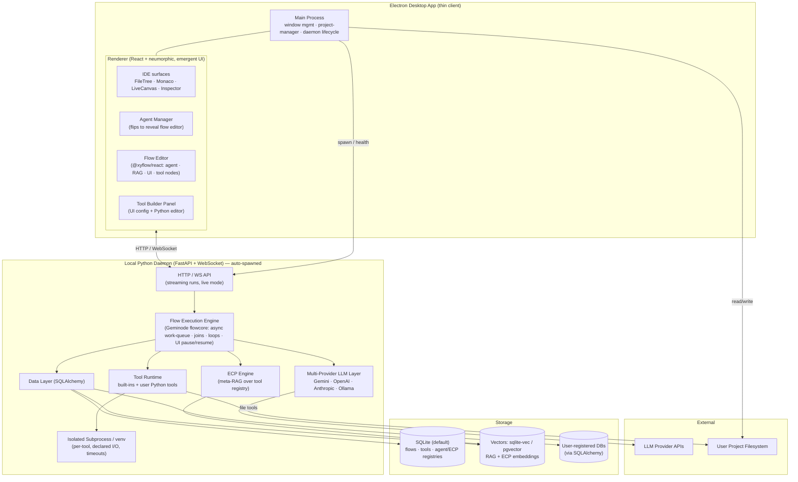

# Taproot Studio — Project Vision

> An agent-native IDE. Not an editor with an AI sidebar bolted on, but a fundamentally
> re-imagined IDE where the agentic layer is a first-class, *designable* surface —
> exposed, not hidden. Comprehensive capability, revealed through **Emergent UI**:
> the interface appears only when it is actually needed.

---

## 1. Vision Statement

Every mainstream "AI IDE" treats agents as an opaque black box: a chat panel, a hidden
system prompt, a fixed toolset you cannot see or shape. **Taproot Studio inverts this.**

Taproot is a desktop IDE in which the user can **design their own arbitrarily complex
sub-agent flows** — how agents are orchestrated, how they communicate, which tools they
can reach for, and how their behavior shifts at runtime — all through a **node-based
editor embedded directly in the main UI**. The agent system is not a feature of the IDE;
it is a substrate the user authors.

This is a pivot of two existing in-house projects, both included here as git submodules:

- **Geminode Studio** (`packages/geminode-studio`) — a node-based agent workflow designer
  (React 19 + `@xyflow/react` + `@google/genai`). Provides the flow editor, agent node
  model, and execution semantics.
- **Reaction Studio** (`packages/reaction-studio`) — an Electron visual React component IDE
  (React 18 + Monaco + Babel/ts-morph). Provides the desktop shell, real filesystem access,
  live preview, AST tooling, a minimal embedded code editor, and the **professional
  neumorphic design language** that defines Taproot's look and feel.

Taproot = **Reaction Studio's IDE backbone + Geminode's agent-flow engine**, fused behind
a local intelligence daemon, wrapped in emergent neumorphic UX.

### Guiding Principles
1. **Re-thought, not re-skinned.** Do not reason about Taproot in the standard IDE frame.
   The mental model is "a malleable agent runtime that happens to also be a great editor."
2. **Emergent UI/UX.** Comprehensive functionality, but the UI only materializes when it
   would actually be useful (context menus, radial/spiral menus, quick-prompts, flip-to-edit
   surfaces). Default state is calm; complexity is on-demand.
3. **Agents are designable, not hidden.** The flow editor, the tools, the context strategy,
   and runtime behavior are all first-class authoring surfaces.
4. **No file-shuffling.** Flows and tools live in a local service, *referenced* into projects
   on demand — never copied between directories by hand.

---

## 2. Confirmed Architectural Decisions

These were locked during the scoping interview and are binding for Phase 1.

| # | Decision | Choice |
|---|----------|--------|
| 1 | **Distribution / shell** | Single **Electron desktop app**. Reaction Studio's Electron shell + `project-manager` is the backbone; Geminode's flow editor is ported in as a flippable in-app panel. |
| 2 | **LLM providers** | **Multi-provider abstraction** behind one interface (Gemini + OpenAI + Anthropic + local/Ollama), **Gemini-first**. |
| 3 | **The "brain"** | A **single local Python daemon** (FastAPI + WebSocket), **bundled with the app and auto-spawned by Electron**. Owns flow storage, flow/agent execution, the multi-provider LLM layer, native Python tool execution, and the vector store for RAG + ECP. The Electron app is a thin client over HTTP/WebSocket. |
| 4 | **Flow storage** | **Global, server-owned** — flows live in the daemon's database and are **imported/enabled into a project by reference**, not copied as files. (User explicitly rejects file/directory-based flow management.) |
| 5 | **Data layer** | **SQLAlchemy** as the daemon's ORM/abstraction. Default backing store **SQLite** (embedded, zero-config); pluggable to Postgres/MySQL. Chosen partly because the node editor will let users wire up **their own databases** for LLMs to query — one consistent abstraction for internal data *and* user data sources. |
| 6 | **Vectors (RAG + ECP)** | **sqlite-vec** by default (embedded alongside the SQLite DB); automatically use **pgvector** when the daemon is pointed at Postgres. *(Default — changeable.)* |
| 7 | **Custom tool execution** | User-authored **Python** tools run in an **isolated subprocess inside a managed venv**, with **declared inputs/outputs and timeouts**. |
| 8 | **Default toolset** | A comprehensive built-in set: AST-skeleton retrieval, file read/write, search, copy, move, etc. — exposed to agents and extensible by users. |

---

## 3. Signature Concepts (the "why this is different")

### 3.1 Flippable Agent Manager
A region of the main UI (the **Agent Manager**) **flips over** to reveal the node-based flow
editor. Users create and manage sub-agent flows in-place, without leaving the IDE — the flow
designer is a face of the workspace, not a separate mode/app.

### 3.2 Agent Node States
Each agent node can declare multiple **states**. A state is a named configuration bundle —
its own model, system prompt, enabled tools, ECP toggle, structured-output/function-calling
setup, etc. Nodes expose **flow handles to *set* and *trigger* state transitions dynamically
at runtime**, effectively making each agent node a small, author-controlled state machine
wired into the larger graph.

### 3.3 Emergent Context Protocol (ECP)
ECP is a **meta-RAG over the tool registry** that solves "tool overload": LLMs given too many
tools tend to use none well.

- Each tool registers **multiple scenario descriptions** — focused, task-oriented statements
  of *when* the tool is useful (a tool can have many registered scenarios).
- As an agent reasons, ECP **embeds the agent's running thoughts/output** and retrieves the
  **top-K most relevant tools**, dynamically shaping the tool list presented to the model
  **each turn**.
- Result: comprehensive capability without drowning the model in options.
- **Optional per-agent (per-state) toggle.**

### 3.4 RAG Nodes & User Data Sources
- A first-class **RAG node** users can drop into any flow for retrieval over their own corpora.
- Via the node editor, users can **register their own databases** (through SQLAlchemy) that
  agents may read from / query — turning external data into agent-accessible context.

### 3.5 Custom Tool Builder
A dedicated **tool panel**: UI inputs/controls for the declarative setup (name, description,
ECP scenarios, typed parameters, timeout) plus a **small embedded Python code editor** (reusing
Reaction Studio's minimal Monaco editor) for the tool's implementation body. Tools become
first-class, ECP-registered citizens of the agent runtime.

### 3.6 The Orchestrator (a flow that dogfoods the system)
Every new chat opens with a default **Orchestrator** agent loaded — but it is **not** special-cased
machinery. It is a **default-but-fully-editable Taproot flow**: open it in the node editor and
reshape it like any user flow. It is project/codebase-aware and ECP-enabled by default.

Crucially, the Orchestrator's *per-surface* behavior is expressed through the product's own
**Agent States** feature (§3.2): a "Code Orchestrator" state on the IDE, a "Node-Graph Designer"
state on the Agent surface, etc. — each with its own tools, instructions, and ECP config. The
orchestrator is the canonical proof that States aren't just for user flows; the product runs on
them. Users can also **swap the Orchestrator out** for any of their own flows on a per-chat-instance
basis (click the agent → attach a different flow → talk to it directly).

### 3.7 Contextual Edge Drawer
The primary chat affordance is an **emergent edge drawer**: the user's pointer approaches a screen
edge and a chat panel slides out (the canonical reference is Reaction Studio's asset-library drawer).
The drawer is **contextual to the surface** — it carries the Orchestrator state appropriate to where
the user is working — and is **absent where it would be redundant** (e.g. the Agent surface already
*is* a chat, so no edge drawer there).

### 3.8 Composable Trust & the Diff Node
There is **no single global "autonomy" setting**. How much an agent can touch the codebase — and how
much a human reviews — is **designed into the flow itself**. Users wire *how* agents find files, read
code, and edit code as nodes, and insert review/approval gates where they want them:
- Any node's output can be **routed to a Chat UI Output** (today: text; roadmap: buttons, inputs,
  forms — already scaffolded by the `ui_interactive` node + engine pause/resume).
- A built-in **Diff Node** (planned) renders the difference between two code versions and pairs with
  a UI-pause gate to produce a human-in-the-loop *approve/reject* step — i.e. human-in-the-loop is a
  *pattern you compose* (diff → chat-approve), not a fixed mode.

### 3.9 Async & Looping Execution (engine reality)
The Geminode execution engine is **already ported to Python** (`packages/geminode-studio/backend/flowcore/engine.py`)
and is materially ahead of the old in-browser TS executor:
- **Async, streaming, work-queue traversal** (`asyncio`, `execute_stream`), with **UI pause/resume**
  (`PauseManager` + `asyncio.Event`) backing interactive nodes.
- **Multi-input join**: a node is held until *all* its forward-incoming handles have a value
  (`_is_ready`) — fan-in/synchronization is built in.
- **First-class loop-back**: a DFS back-edge detector (`_find_back_edges`) classifies cycle edges;
  forward edges gate readiness while **back-edges re-queue** their target, bounded by
  `MAX_NODE_EXECUTIONS = 25` per node.
- **Conditional routing**: function-call handles and structured-output handles select downstream
  edges (how a loop's exit branch is expressed).

**Still to build** (target behavior the user wants): the work-queue currently drains **one node at a
time**, so independent branches *interleave* rather than truly run in parallel — add concurrent
execution of all *ready* nodes per tick (`asyncio.gather`) plus a **per-node / per-port "async / await
this input" opt-in**; and add a first-class **Loop node** (loops are currently pure graph topology).

---

## 4. Workspace & Interaction Model

The single most distinctive thing about Taproot's UX is its spatial workspace. This is the spine of
the "re-thought IDE."

### 4.1 Five Persistent Surfaces (a cross)
Five persistent surfaces are arranged as a cross, with the **IDE at the canonical center**:

```
                 [ Concept Designer ]
                          |
       [ Agent ] —— [   IDE   ] —— [ Project Board ]
                          |
                 [ Knowledge Base ]
```

- **IDE** — code view & editor (canonical center).
- **Agent** — chat + a surface that **flips** to the node/flow editor.
- **Project Board** — agent-aware project management (see §4.6).
- **Concept Designer** — a full whiteboard/blackboard for sketching concepts *for* an agent;
  multimodal drawings become agent input (the engine already has `IMAGE`/`VIDEO`/`AUDIO`/`ANY`
  data-type ports).
- **Knowledge Base** — user-added knowledge + agent-accessible databases.

### 4.2 Swap-Rotation Navigation
The user drags the workspace up/down/left/right to move between surfaces, rendered as a fluid
full-screen swap/rotation. One governing rule generates the entire model:

> **When you rotate in a direction, that surface comes to center and the IDE drops into the slot you
> rotated *from*. Repeating the same gesture always brings the IDE back. The opposite outer surface
> sits on the far side (reached by the opposite gesture). Switching to the other axis re-centers that
> axis on the IDE.**

Consequences (all learnable):
- Each outer surface has a **permanent canonical gesture from the IDE** — e.g. *up → Concept Designer*,
  *down → Knowledge Base*, *left → Agent*, *right → Project Board* (rotational direction).
- From any outer surface: **repeat your last gesture → IDE**; **opposite gesture → the opposite outer**.
- Only the **IDE "floats,"** and its mnemonic is dead simple: *"repeat to go home."*

Worked traces (rotational direction):
- `up + up` → IDE → Concept Designer → **IDE** (repeat = home)
- `up + down` → IDE → Concept Designer → **Knowledge Base** (opposite outer)
- `up + down + down` → IDE → CD → KB → **IDE** (repeat = home)
- `up + down + up` → IDE → CD → KB → **Concept Designer** (opposite outer)

This gives the **predictability of a fixed plus-hub** (outers never move) wrapped in the **fluid feel
of an orb** — only one thing to track (the IDE), with a one-line rule.

### 4.3 3D Mini-Compass
A persistent **mini-compass** is a live, shrunk mirror of the orb itself: tiny rectangles swapping in
**simulated depth**, the centered surface largest/closest to the user, and the IDE's *current* slot
called out by a highlight color. The compass teaches the navigation model by showing it. **Optional
accelerators** (not crutches): click a tile — or press **number keys 1–5** — to jump straight to a
surface. Color is paired with **icon + label** (never color alone) for accessibility.

### 4.4 Emergent UI Patterns (named)
- **Edge drawer** — pointer-to-edge reveals a contextual chat panel (§3.7).
- **Hover/intent-to-expand panels** — collapsed-by-default panels expand on hover/intent to conserve
  space (canonical example: Reaction Studio's code editor sliding out when hovered).
- **Flip-to-edit** — a surface flips to reveal its authoring view (Agent Manager → flow editor).

### 4.5 Design Language
**Dark professional neumorphism** (Reaction Studio's look): soft extruded/inset panels on a
low-contrast charcoal field, gentle dual shadows for depth, generous radii, a restrained
**amber/copper accent** (exact accent TBD), monospace code with muted syntax highlighting, and
tactile controls (segmented toggles, sliders, pill buttons). Implementation plan: promote Reaction
Studio's `packages/reaction-studio/src/styles.ts` neumorphic primitives into a shared `packages/ui`
as the canonical design system.

### 4.6 Project Board Surface
An **agent-aware project-management surface** — *needs further detail in a later round*, but the
shape is:
- Hierarchy: **projects ▸ milestones ▸ sprints ▸ issues ▸ blocking** relationships.
- **Both agents and users** create/update items. An agent working a task can **auto-open issue(s),
  self-assign, and stream live status**; In-Progress issues show the agent's *current step* in real
  time, Done issues show a short summary.
- A per-node **"track via kanban"** toggle tells an agent whether work should be boarded/tracked.
- A user can create an issue and **assign a flow** to it.
- Layout: **kanban view** and an **optional flow-graph layout** (issues as nodes with connecting
  lines).
- Interaction (emergent): **hover an issue → it expands**, temporarily shrinking neighbors;
  **click → issue on one side, chat on the other**; roadmap: click a specific aspect of an issue to
  **auto-navigate to the exact point in the agent chat** where it was worked on.

---

## 5. System Architecture



### Component Responsibilities

**Electron (thin client)**
- *Main process*: window/title-bar management, `project-manager` (open project, file tree,
  watch), and **daemon lifecycle** (spawn on launch, health-check, restart, shutdown).
- *Renderer*: all UI. IDE surfaces from Reaction Studio (FileTree, Monaco, LiveCanvas preview
  via the `component-server` Vite plugin, Inspector, SpiralMenu/QuickPrompt). The Agent Manager
  + ported Geminode flow editor. The Tool Builder panel. Talks to the daemon over HTTP/WS.

**Python daemon (the brain)**
- *Flow execution engine*: the **existing Python `flowcore` engine** (already ported from the legacy
  TS `workflowExecutor`): async work-queue traversal, structured-output/function-call branching,
  multi-input joins, back-edge loops, streaming step events, and UI pause/resume. To be **extended**
  for agent states + ECP, parallel fan-out, per-port async, and a first-class Loop node.
- *Persistence gap*: the daemon is currently **execution-only and stateless** (flows live as
  `flows/*.json` + frontend `localStorage`; no SQLAlchemy, DB, or vector store yet). The global
  SQLAlchemy flow store + RAG/ECP vectors are greenfield (Decisions 4–6).
- *Multi-provider LLM layer*: one interface, provider adapters (Gemini-first).
- *ECP engine*: embeds running agent thoughts, retrieves top-K relevant tools per turn.
- *Tool runtime*: built-in tools + user Python tools, the latter sandboxed per-tool in a
  managed venv subprocess.
- *Data layer (SQLAlchemy)*: flows, tool defs, agent/ECP registries, and user-registered DBs.

---

## 6. Data Model (initial sketch)

```mermaid
erDiagram
    FLOW ||--o{ FLOW_NODE : contains
    FLOW ||--o{ FLOW_EDGE : contains
    FLOW ||--o{ PROJECT_FLOW_LINK : "enabled in"
    PROJECT ||--o{ PROJECT_FLOW_LINK : references
    FLOW_NODE ||--o{ AGENT_STATE : "has (if agent)"
    AGENT_STATE ||--o{ STATE_TOOL_LINK : "enables"
    TOOL ||--o{ TOOL_SCENARIO : "registers (ECP)"
    TOOL ||--o{ STATE_TOOL_LINK : "linked by"
    TOOL ||--o{ TOOL_VERSION : versions
    DATA_SOURCE ||--o{ FLOW_NODE : "queried by RAG/DB nodes"
    PROJECT ||--o{ MILESTONE : "has"
    MILESTONE ||--o{ SPRINT : "has"
    PROJECT ||--o{ ISSUE : "has"
    SPRINT ||--o{ ISSUE : "schedules"
    ISSUE ||--o{ ISSUE_BLOCK : "blocks/blocked-by"
    FLOW ||--o{ ISSUE : "assigned to"
    ISSUE ||--o{ ISSUE_EVENT : "live status"

    FLOW { string id PK; string name; json meta; datetime created_at }
    PROJECT { string id PK; string root_path; string name }
    PROJECT_FLOW_LINK { string project_id FK; string flow_id FK; bool enabled }
    FLOW_NODE { string id PK; string flow_id FK; string type; json data }
    FLOW_EDGE { string id PK; string flow_id FK; string source; string target; json branch }
    AGENT_STATE { string id PK; string node_id FK; string name; json config }
    TOOL { string id PK; string name; string kind; text python_body; json params }
    TOOL_SCENARIO { string id PK; string tool_id FK; text description; vector embedding }
    TOOL_VERSION { string id PK; string tool_id FK; int version; text body }
    STATE_TOOL_LINK { string state_id FK; string tool_id FK }
    DATA_SOURCE { string id PK; string name; string sqlalchemy_url; json schema_hint }
    MILESTONE { string id PK; string project_id FK; string name; string status }
    SPRINT { string id PK; string milestone_id FK; string name; date start; date end }
    ISSUE { string id PK; string project_id FK; string sprint_id FK; string flow_id FK; string title; string status; string author_kind; bool track_via_kanban; text live_summary }
    ISSUE_BLOCK { string issue_id FK; string blocked_by_id FK }
    ISSUE_EVENT { string id PK; string issue_id FK; string chat_message_id; text current_step; datetime ts }
```

> The **Project Board** model (`MILESTONE`/`SPRINT`/`ISSUE`/`ISSUE_BLOCK`/`ISSUE_EVENT`) supports both
> human- and agent-authored issues (`author_kind`), the per-node **`track_via_kanban`** toggle, flows
> assigned to issues (`ISSUE.flow_id`), and live status streamed via `ISSUE_EVENT` (whose
> `chat_message_id` enables deep-linking an issue back to the exact point in the agent chat). *Board
> model is provisional — to be refined in a later scoping round.*
>
> Flows are **global** and **linked** into projects via `PROJECT_FLOW_LINK` — enabling/importing
> by reference, never by file copy. `TOOL_SCENARIO.embedding` is the ECP index.

---

## 7. Out of Scope (MVP Boundaries)

Explicitly **not** in the first iteration, to prevent feature creep:

- **Remote/cloud daemon, multi-user collaboration, or hosted sync.** Daemon is local-only.
- **Marketplace / sharing of flows & tools** between users.
- **Non-Python custom tools** (e.g. JS/TS tool bodies). Python only for MVP.
- **Full container/gVisor sandboxing** for tools. MVP ships subprocess+venv isolation only;
  hardened sandbox is a fast-follow.
- **Postgres/pgvector path as the default.** Supported by the SQLAlchemy/vector abstraction
  but SQLite + sqlite-vec is the only *shipped/tested* default in Phase 1.
- **Provider breadth beyond Gemini/OpenAI/Anthropic/Ollama.**
- **Mobile/web build targets.** Electron desktop only.
- **Porting every Geminode UI-editor node** day one; bring the core node set first.
- **Auto-migration of existing Geminode `localStorage` flows** (legacy import is a later nicety).

---

## 8. Risk Assessment

| Risk | Severity | Notes / Mitigation |
|------|----------|--------------------|
| **Python runtime packaging in Electron** | High | Shipping/spawning a Python interpreter cross-platform (PyInstaller / embeddable Python / `uv`). Spike this **first** (Phase 1, Stream A) — it gates everything. Define a stable spawn + health-check + IPC contract early. |
| **React 18 vs 19 mismatch** | High | Reaction Studio is React 18; Geminode is React 19 and imports **both** `@xyflow/react@12` *and* `reactflow@11`. Must consolidate to one React + one React Flow version when porting the editor. Pick the shell's React version as canonical. |
| **Monorepo has no root tooling** | Medium | Root is just two submodules + `.gitmodules`; no workspace config. Establish `apps/` + `packages/` layout, a JS workspace manager, and a Python project for the daemon before parallel work. |
| **Per-tool subprocess/venv latency** | Medium | Cold-starting a venv per call is slow. Mitigate with a warm worker pool, dependency caching, and reusing interpreters across invocations. |
| **Arbitrary Python execution & secrets** | High (security) | User tools run real code; daemon holds LLM keys + user DB credentials. Enforce timeouts, resource limits, least-privilege, encrypted secret storage; never log secrets. Plan hardened sandbox as fast-follow. |
| **ECP latency/cost** | Medium | Embedding running thoughts every turn adds latency and token/embedding cost. Debounce, cache embeddings, cap K, allow cheap local embedding models. |
| **Extending the `flowcore` engine** | Medium | Execution is **already in Python** (`backend/flowcore`) but is **Gemini-only** and **single-active-node** (no true parallelism). Work shifts from *porting* to *extending*: provider-agnostic LLM layer, concurrent execution of ready nodes, per-port async opt-in, Loop + Diff nodes, States + ECP — without breaking the existing async/join/loop semantics or its pytest suite. |
| **Backend persistence is greenfield** | Medium | The daemon is execution-only/stateless today (flows = JSON files + `localStorage`). The SQLAlchemy global flow store, project/board model, and vector store (RAG + ECP) must be built from scratch and wired into the engine's load path. |
| **Streaming/live-mode over WS** | Medium | Geminode's live audio/TTS + streaming must be re-expressed over the daemon WS protocol. Define event schema early (mirror its `onStep`/`ChatMessage` step events). |
| **Submodule workflow friction** | Low | Contributors must init submodules; pinned commits can drift. Document the init flow; consider vendoring if churn is high. |

---

## 9. Glossary

- **ECP (Emergent Context Protocol)** — meta-RAG that dynamically narrows an agent's tool list
  to those most relevant to its current reasoning, based on embedded scenario descriptions.
- **Agent State** — a named configuration bundle on an agent node, switchable at runtime via
  flow handles.
- **Flow** — a node graph defining a sub-agent workflow; stored globally, linked into projects.
- **Daemon** — the local Python (FastAPI) process that executes flows, runs tools, and serves
  the Electron client.
- **Orchestrator** — the default, fully-editable flow loaded into every new chat; project-aware,
  ECP-enabled, with per-surface Agent States. Swappable per chat instance.
- **Surface** — one of the five persistent workspace panels (IDE, Agent, Project Board, Concept
  Designer, Knowledge Base) arranged in a cross.
- **Swap-Rotation Navigation** — the drag-to-move model where outer surfaces stay put and only the
  IDE "floats"; *repeat the last gesture to return to the IDE*.
- **Edge Drawer** — a contextual chat panel that emerges when the pointer nears a screen edge;
  absent on surfaces where chat is redundant.
- **Diff Node** — a planned node that renders two code versions, paired with a UI-pause gate for
  composable human-in-the-loop approval.
- **flowcore** — the existing Python execution engine package (`backend/flowcore`): async work-queue
  traversal with multi-input joins, back-edge loops, and UI pause/resume.
- **Emergent UI** — UI that appears only when contextually useful.
