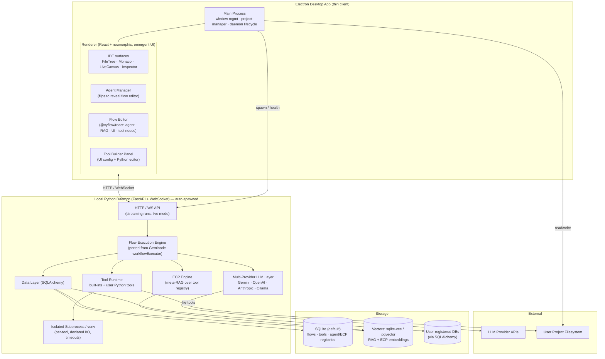

# Taproot Studio — Project Vision

> An agent-native IDE. Not an editor with an AI sidebar bolted on, but a fundamentally
> re-imagined IDE where the agentic layer is a first-class, *designable* surface —
> exposed, not hidden. Comprehensive capability, revealed through **Emergent UI**:
> the interface appears only when it is actually needed.

---

## 1. Vision Statement

Every mainstream "AI IDE" treats agents as an opaque black box: a chat panel, a hidden
system prompt, a fixed toolset you cannot see or shape. **Taproot Studio inverts this.**

Taproot is a desktop IDE in which the user can **design their own arbitrarily complex
sub-agent flows** — how agents are orchestrated, how they communicate, which tools they
can reach for, and how their behavior shifts at runtime — all through a **node-based
editor embedded directly in the main UI**. The agent system is not a feature of the IDE;
it is a substrate the user authors.

This is a pivot of two existing in-house projects, both included here as git submodules:

- **Geminode Studio** (`packages/geminode-studio`) — a node-based agent workflow designer
  (React 19 + `@xyflow/react` + `@google/genai`). Provides the flow editor, agent node
  model, and execution semantics.
- **Reaction Studio** (`packages/reaction-studio`) — an Electron visual React component IDE
  (React 18 + Monaco + Babel/ts-morph). Provides the desktop shell, real filesystem access,
  live preview, AST tooling, a minimal embedded code editor, and the **professional
  neumorphic design language** that defines Taproot's look and feel.

Taproot = **Reaction Studio's IDE backbone + Geminode's agent-flow engine**, fused behind
a local intelligence daemon, wrapped in emergent neumorphic UX.

### Guiding Principles
1. **Re-thought, not re-skinned.** Do not reason about Taproot in the standard IDE frame.
   The mental model is "a malleable agent runtime that happens to also be a great editor."
2. **Emergent UI/UX.** Comprehensive functionality, but the UI only materializes when it
   would actually be useful (context menus, radial/spiral menus, quick-prompts, flip-to-edit
   surfaces). Default state is calm; complexity is on-demand.
3. **Agents are designable, not hidden.** The flow editor, the tools, the context strategy,
   and runtime behavior are all first-class authoring surfaces.
4. **No file-shuffling.** Flows and tools live in a local service, *referenced* into projects
   on demand — never copied between directories by hand.

---

## 2. Confirmed Architectural Decisions

These were locked during the scoping interview and are binding for Phase 1.

| # | Decision | Choice |
|---|----------|--------|
| 1 | **Distribution / shell** | Single **Electron desktop app**. Reaction Studio's Electron shell + `project-manager` is the backbone; Geminode's flow editor is ported in as a flippable in-app panel. |
| 2 | **LLM providers** | **Multi-provider abstraction** behind one interface (Gemini + OpenAI + Anthropic + local/Ollama), **Gemini-first**. |
| 3 | **The "brain"** | A **single local Python daemon** (FastAPI + WebSocket), **bundled with the app and auto-spawned by Electron**. Owns flow storage, flow/agent execution, the multi-provider LLM layer, native Python tool execution, and the vector store for RAG + ECP. The Electron app is a thin client over HTTP/WebSocket. |
| 4 | **Flow storage** | **Global, server-owned** — flows live in the daemon's database and are **imported/enabled into a project by reference**, not copied as files. (User explicitly rejects file/directory-based flow management.) |
| 5 | **Data layer** | **SQLAlchemy** as the daemon's ORM/abstraction. Default backing store **SQLite** (embedded, zero-config); pluggable to Postgres/MySQL. Chosen partly because the node editor will let users wire up **their own databases** for LLMs to query — one consistent abstraction for internal data *and* user data sources. |
| 6 | **Vectors (RAG + ECP)** | **sqlite-vec** by default (embedded alongside the SQLite DB); automatically use **pgvector** when the daemon is pointed at Postgres. *(Default — changeable.)* |
| 7 | **Custom tool execution** | User-authored **Python** tools run in an **isolated subprocess inside a managed venv**, with **declared inputs/outputs and timeouts**. |
| 8 | **Default toolset** | A comprehensive built-in set: AST-skeleton retrieval, file read/write, search, copy, move, etc. — exposed to agents and extensible by users. |

---

## 3. Signature Concepts (the "why this is different")

### 3.1 Flippable Agent Manager
A region of the main UI (the **Agent Manager**) **flips over** to reveal the node-based flow
editor. Users create and manage sub-agent flows in-place, without leaving the IDE — the flow
designer is a face of the workspace, not a separate mode/app.

### 3.2 Agent Node States
Each agent node can declare multiple **states**. A state is a named configuration bundle —
its own model, system prompt, enabled tools, ECP toggle, structured-output/function-calling
setup, etc. Nodes expose **flow handles to *set* and *trigger* state transitions dynamically
at runtime**, effectively making each agent node a small, author-controlled state machine
wired into the larger graph.

### 3.3 Emergent Context Protocol (ECP)
ECP is a **meta-RAG over the tool registry** that solves "tool overload": LLMs given too many
tools tend to use none well.

- Each tool registers **multiple scenario descriptions** — focused, task-oriented statements
  of *when* the tool is useful (a tool can have many registered scenarios).
- As an agent reasons, ECP **embeds the agent's running thoughts/output** and retrieves the
  **top-K most relevant tools**, dynamically shaping the tool list presented to the model
  **each turn**.
- Result: comprehensive capability without drowning the model in options.
- **Optional per-agent (per-state) toggle.**

### 3.4 RAG Nodes & User Data Sources
- A first-class **RAG node** users can drop into any flow for retrieval over their own corpora.
- Via the node editor, users can **register their own databases** (through SQLAlchemy) that
  agents may read from / query — turning external data into agent-accessible context.

### 3.5 Custom Tool Builder
A dedicated **tool panel**: UI inputs/controls for the declarative setup (name, description,
ECP scenarios, typed parameters, timeout) plus a **small embedded Python code editor** (reusing
Reaction Studio's minimal Monaco editor) for the tool's implementation body. Tools become
first-class, ECP-registered citizens of the agent runtime.

---

## 4. System Architecture



### Component Responsibilities

**Electron (thin client)**
- *Main process*: window/title-bar management, `project-manager` (open project, file tree,
  watch), and **daemon lifecycle** (spawn on launch, health-check, restart, shutdown).
- *Renderer*: all UI. IDE surfaces from Reaction Studio (FileTree, Monaco, LiveCanvas preview
  via the `component-server` Vite plugin, Inspector, SpiralMenu/QuickPrompt). The Agent Manager
  + ported Geminode flow editor. The Tool Builder panel. Talks to the daemon over HTTP/WS.

**Python daemon (the brain)**
- *Flow execution engine*: port of Geminode's `workflowExecutor` semantics (start → graph
  traversal → end, edge/structured-output branching, streaming step events, live-mode handoff)
  to Python, extended for agent states + ECP.
- *Multi-provider LLM layer*: one interface, provider adapters (Gemini-first).
- *ECP engine*: embeds running agent thoughts, retrieves top-K relevant tools per turn.
- *Tool runtime*: built-in tools + user Python tools, the latter sandboxed per-tool in a
  managed venv subprocess.
- *Data layer (SQLAlchemy)*: flows, tool defs, agent/ECP registries, and user-registered DBs.

---

## 5. Data Model (initial sketch)

```mermaid
erDiagram
    FLOW ||--o{ FLOW_NODE : contains
    FLOW ||--o{ FLOW_EDGE : contains
    FLOW ||--o{ PROJECT_FLOW_LINK : "enabled in"
    PROJECT ||--o{ PROJECT_FLOW_LINK : references
    FLOW_NODE ||--o{ AGENT_STATE : "has (if agent)"
    AGENT_STATE ||--o{ STATE_TOOL_LINK : "enables"
    TOOL ||--o{ TOOL_SCENARIO : "registers (ECP)"
    TOOL ||--o{ STATE_TOOL_LINK : "linked by"
    TOOL ||--o{ TOOL_VERSION : versions
    DATA_SOURCE ||--o{ FLOW_NODE : "queried by RAG/DB nodes"

    FLOW { string id PK; string name; json meta; datetime created_at }
    PROJECT { string id PK; string root_path; string name }
    PROJECT_FLOW_LINK { string project_id FK; string flow_id FK; bool enabled }
    FLOW_NODE { string id PK; string flow_id FK; string type; json data }
    FLOW_EDGE { string id PK; string flow_id FK; string source; string target; json branch }
    AGENT_STATE { string id PK; string node_id FK; string name; json config }
    TOOL { string id PK; string name; string kind; text python_body; json params }
    TOOL_SCENARIO { string id PK; string tool_id FK; text description; vector embedding }
    TOOL_VERSION { string id PK; string tool_id FK; int version; text body }
    STATE_TOOL_LINK { string state_id FK; string tool_id FK }
    DATA_SOURCE { string id PK; string name; string sqlalchemy_url; json schema_hint }
```

> Flows are **global** and **linked** into projects via `PROJECT_FLOW_LINK` — enabling/importing
> by reference, never by file copy. `TOOL_SCENARIO.embedding` is the ECP index.

---

## 6. Out of Scope (MVP Boundaries)

Explicitly **not** in the first iteration, to prevent feature creep:

- **Remote/cloud daemon, multi-user collaboration, or hosted sync.** Daemon is local-only.
- **Marketplace / sharing of flows & tools** between users.
- **Non-Python custom tools** (e.g. JS/TS tool bodies). Python only for MVP.
- **Full container/gVisor sandboxing** for tools. MVP ships subprocess+venv isolation only;
  hardened sandbox is a fast-follow.
- **Postgres/pgvector path as the default.** Supported by the SQLAlchemy/vector abstraction
  but SQLite + sqlite-vec is the only *shipped/tested* default in Phase 1.
- **Provider breadth beyond Gemini/OpenAI/Anthropic/Ollama.**
- **Mobile/web build targets.** Electron desktop only.
- **Porting every Geminode UI-editor node** day one; bring the core node set first.
- **Auto-migration of existing Geminode `localStorage` flows** (legacy import is a later nicety).

---

## 7. Risk Assessment

| Risk | Severity | Notes / Mitigation |
|------|----------|--------------------|
| **Python runtime packaging in Electron** | High | Shipping/spawning a Python interpreter cross-platform (PyInstaller / embeddable Python / `uv`). Spike this **first** (Phase 1, Stream A) — it gates everything. Define a stable spawn + health-check + IPC contract early. |
| **React 18 vs 19 mismatch** | High | Reaction Studio is React 18; Geminode is React 19 and imports **both** `@xyflow/react@12` *and* `reactflow@11`. Must consolidate to one React + one React Flow version when porting the editor. Pick the shell's React version as canonical. |
| **Monorepo has no root tooling** | Medium | Root is just two submodules + `.gitmodules`; no workspace config. Establish `apps/` + `packages/` layout, a JS workspace manager, and a Python project for the daemon before parallel work. |
| **Per-tool subprocess/venv latency** | Medium | Cold-starting a venv per call is slow. Mitigate with a warm worker pool, dependency caching, and reusing interpreters across invocations. |
| **Arbitrary Python execution & secrets** | High (security) | User tools run real code; daemon holds LLM keys + user DB credentials. Enforce timeouts, resource limits, least-privilege, encrypted secret storage; never log secrets. Plan hardened sandbox as fast-follow. |
| **ECP latency/cost** | Medium | Embedding running thoughts every turn adds latency and token/embedding cost. Debounce, cache embeddings, cap K, allow cheap local embedding models. |
| **Re-homing Geminode execution** | Medium | Logic currently runs in-browser against `@google/genai`; must move to the daemon and become provider-agnostic. Treat `workflowExecutor.ts` as the spec, not the implementation. |
| **Streaming/live-mode over WS** | Medium | Geminode's live audio/TTS + streaming must be re-expressed over the daemon WS protocol. Define event schema early (mirror its `onStep`/`ChatMessage` step events). |
| **Submodule workflow friction** | Low | Contributors must init submodules; pinned commits can drift. Document the init flow; consider vendoring if churn is high. |

---

## 8. Glossary

- **ECP (Emergent Context Protocol)** — meta-RAG that dynamically narrows an agent's tool list
  to those most relevant to its current reasoning, based on embedded scenario descriptions.
- **Agent State** — a named configuration bundle on an agent node, switchable at runtime via
  flow handles.
- **Flow** — a node graph defining a sub-agent workflow; stored globally, linked into projects.
- **Daemon** — the local Python (FastAPI) process that executes flows, runs tools, and serves
  the Electron client.
- **Emergent UI** — UI that appears only when contextually useful.
